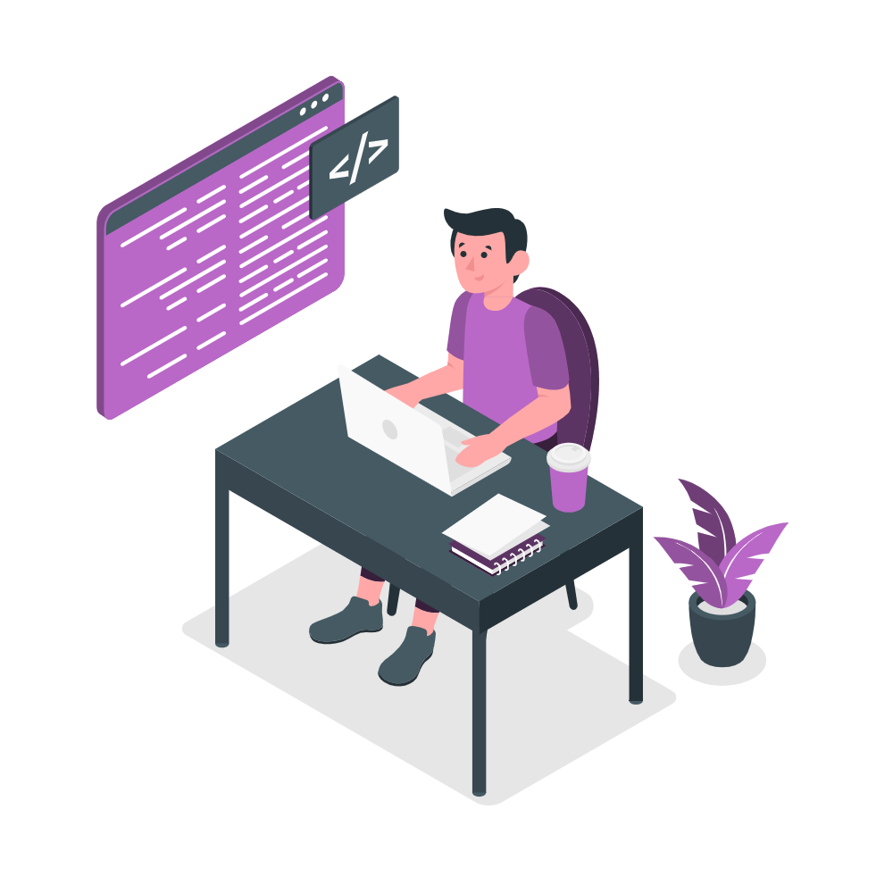

<h2 align="center">
  Priyanka Patel | Portfolio v1.0 
  <a href="https://github.com/Priyankapatel21/Portfolio" target="_blank">View Repository</a>
</h2>

  

 

 &nbsp;
 &nbsp;
 &nbsp;
 &nbsp;

<h3 align="center">
    🔹
    <a href="https://github.com/Priyankapatel21/Portfolio/issues">Report Bug</a> &nbsp; &nbsp;
    🔹
    <a href="https://github.com/Priyankapatel21/Portfolio/issues">Request Feature</a>
</h3>

## Built With

My personal portfolio which features my GitHub projects, resume, and technical skills.

This project was built using these technologies:

- **React.js**
- **Node.js**
- **React-Bootstrap**
- **EmailJS**
- **CSS3**
- **VS Code**

## Features

**📖 Multi-Page Layout**
**🎨 Styled with React-Bootstrap and CSS**
**📱 Fully Responsive Design**
**✉️ Integrated Contact Form via EmailJS**

## Getting Started

Clone down this repository. You will need `node.js` and `git` installed globally on your machine.

## 🛠 Installation and Setup Instructions

1. Installation: `npm install`
2. Run the app: `npm start`

Runs the app in development mode.  
Open [http://localhost:3000](http://localhost:3000) to view it in the browser.

---

### Show your support

Give a ⭐ if you like this project!